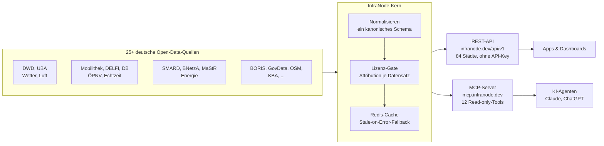

Deutsch | [English](./README.en.md)

# InfraNode

[](https://github.com/street1983nk/infranode/stargazers)
[](./LICENSE)
[](https://glama.ai/mcp/servers/street1983nk/infranode)
[](https://registry.modelcontextprotocol.io)
[](https://smithery.ai/server/infranode/infranode)

**Die Open-Data-REST-API für Deutschland: eine HTTP-API ohne API-Key für Open
Data zur öffentlichen Infrastruktur, auch als MCP-Server verfügbar.**

Deutsche Städte veröffentlichen viel Open Data, aber jede Quelle hat ihr eigenes
Format, eigene Felder und eigene Eigenheiten, und für mehrere braucht es eine
Registrierung im jeweiligen Portal. InfraNode normalisiert rund 20 Kategorien,
Wetter (DWD), Luftqualität (UBA), ÖPNV (inklusive Echtzeit-Abfahrten), Verkehr,
Strompreis (SMARD), Bodenrichtwerte (BORIS), Parken, Ladeinfrastruktur,
Pegelstände, Demografie, Energie und mehr, für **84+ deutsche Städte** hinter
**einer** Schnittstelle. **Kein API-Key, kein Konto.** Jede Antwort nutzt
denselben kanonischen `{ data, meta }`-Umschlag mit Lizenz und Attribution je
Datensatz. Dieselben Daten stehen KI-Agenten auch als MCP-Server zur Verfügung
(12 schlanke Read-only-Tools über 78 Datenarten).
Der Einstieg ist `get_city_overview`, ein einziger Aufruf: Er liefert einen
Katalog aller Datenarten, die es für eine Stadt gibt, dazu einen Live-Auszug der
wichtigsten Werte. So sehen Agenten die volle Breite und nicht nur das Wetter.
InfraNode wächst laufend, neue Datenarten und Städte kommen regelmäßig dazu.

Zu den Quellen gehören der Deutsche Wetterdienst (DWD), das Umweltbundesamt
(UBA), Mobilithek/DELFI, der VBB (Verkehrsverbund Berlin-Brandenburg, CC-BY 4.0),
GovData, OpenStreetMap, die Bundesnetzagentur, das KBA und weitere.

## Im Einsatz

[](https://infranode.dev)

*Ein einziger `get_city_overview("koeln")`-Aufruf: aktuelles Wetter, amtliche
Luftqualität, DWD-Warnungen, Live-Zugabfahrten mit Verspätungen, Baustellen und
der vollständige Datenkatalog der Stadt, aus einem Endpoint ohne API-Key. Jede
Stadt lässt sich live ausprobieren auf
[infranode.dev](https://infranode.dev).*

## So funktioniert es

Ein gemeinsamer HTTP-Client fragt die Upstream-Quellen ab, jede Antwort wird auf
das kanonische Schema abgebildet, mit ihrer Attribution durch das Lizenz-Gate
geführt und in Redis zwischengespeichert (mit Stale-on-Error-Fallback), danach
über eine REST-API und einen MCP-Server ausgeliefert. Fällt eine Quelle aus,
schlägt sich das in `source_status` nieder. Der Aufruf selbst scheitert nie
daran.



> Wenn InfraNode dir eine Datenintegration erspart: Ein Stern hilft anderen Entwicklern, das Projekt zu finden.

## Schnellstart

Basis-URL `https://infranode.dev/api/v1`. Kein Key, kein Konto, einfach
aufrufen:

```bash
curl https://infranode.dev/api/v1/cities/koeln/weather
```

```jsonc
{
  "data": {
    "city_slug": "koeln",
    "observed_at": "2026-06-18T13:00:00Z",
    "source": "dwd",
    "attribution": { "text": "Datenbasis: Deutscher Wetterdienst", "modified": true },
    "payload": { "kind": "weather", "temperature_c": 30.4, "humidity": 43.0, "station_id": "02667" }
  },
  "meta": { "source_status": "ok", "cache_status": "hit", "correlation_id": "..." }
}
```

Jede Antwort folgt demselben `{ data, meta }`-Umschlag: Jeder Datensatz trägt
seine `attribution` (Lizenz und Quelle), und `meta.source_status` sagt, ob die
Upstream-Quelle Daten geliefert hat. Eine tote Quelle degradiert damit sauber,
statt den Aufruf scheitern zu lassen.

Über alle Datenarten hinweg sind Feldnamen snake_case und englisch, und dasselbe
Konzept heißt immer gleich: `post_code`, `street`, `house_number`, `place`,
`name`, `start`, `end`, `distance_km`, `power_kw`, `lat`, `lon`. `post_code` ist
immer ein fünfstelliger String (führende Nullen bleiben erhalten), Zeitstempel
sind ISO 8601 mit Zeitzone, und ein Wert, den die Quelle nicht liefert, ist
`null`, nie ein leerer String. Manche Antworten führen daneben noch ältere
Doppelnamen mit identischen Werten (`plz`, `zip`, `strasse`, `hausnummer`, `ort`,
`city`, `bezeichnung`, `beginn`, `ende`, `art`, `dist_km`, `leistung_kw`,
`einheit_typ`, dazu die camelCase-Rohfelder der Autobahn-Verkehrsmeldungen).
Diese Namen sind veraltet, nimm die kanonischen.

> Tipp: Ruf zuerst `/api/v1/cities` auf, um die kanonischen Stadt-Slugs zu
> finden (etwa `koeln`, `berlin`, `hamburg`), und danach einen stadtbezogenen
> Endpoint.
>
> Der `{slug}` wird tolerant aufgelöst, die exakte ASCII-Form brauchst du also
> selten: der deutsche Name mit oder ohne Umlaute, jede Groß- und
> Kleinschreibung, gängige englische Exonyme und Kurzformen führen alle auf den
> kanonischen Slug (`München`/`münchen`/`munich`/`munchen` → `muenchen`,
> `cologne` → `koeln`, `frankfurt` → `frankfurt-am-main`). Ein unbekannter Name
> liefert `404` mit dem Hinweis `Meintest du ...?`, der den nächstliegenden Slug
> nennt.

[](https://god.gw.postman.com/run-collection/55901679-26601800-bf9d-4ddd-8413-5f273f18be4d)

Die vollständige interaktive Referenz und die Abdeckung je Stadt stehen auf
[infranode.dev](https://infranode.dev). Die
[InfraNode API im Postman API Network](https://www.postman.com/alster83-7133231/infranode/overview)
spiegelt jeden Endpoint mit echten Beispielantworten, sodass sich die
[InfraNode API Postman Collection](https://www.postman.com/alster83-7133231/infranode/collection/pft781f/infranode-api)
ohne API-Key direkt im Browser ausprobieren lässt.

<!-- Die Endpunktzahl stammt aus docs/openapi.yaml (eine operationId je Operation).
     Sie muss synchron bleiben: docs-site/scripts/check-endpoint-count.mjs prüft das. -->
## Daten (84 Städte, 124 Endpunkte)

Jede Kategorie unten ist ein REST-Endpoint unter
`/api/v1/cities/{slug}/<key>`. Über MCP kommen dieselben Daten durch 12 schlanke
Tools: ein paar benannte (`get_city_overview`, `weather`, `air_quality`, `pois`,
`compare`, die Live-Tafeln) und ein generisches
`get_city_resource(slug, resource=<key>)` für jede weitere Datenart (sein
`resource`-Enum listet alle 81 Keys).

| Gruppe | Datenarten (Endpoint-Keys) |
|--------|----------------------------|
| **Entdecken** | `list_cities`, `sources`, `compare` (eine Datenart über viele Städte), `overview` (Katalog plus Live-Auszug in einem Aufruf) |
| **Wetter & Umwelt** | `weather`, `weather-warnings`, `civil-protection-warnings` (BBK NINA), `air-uba` (amtlich), `air` (live), `pollen-uv`, `water-level`, `flood`, `fire-danger`, `bathing-water` |
| **Mobilität** | `transit`, Live-Abfahrten je Haltestelle (Tool `transit_departures`), `stations` (Katalog), Bahnhofstafeln nach EVA (Tools `station_board_departures`/`station_board_arrivals`, inklusive Nahverkehr und Störungen), `station-departures`, `station-arrivals`, `traffic`, `road-events`, `webcams`, `charging`, `parking` (Live-Belegung), `parking-onstreet`, `park-and-ride`, `mobility-points`, `bike-parking`, `sharing`, `fuel-prices`, `bike-counts` |
| **Stadt & Menschen** | `base`, `geo`, `demographics`, `indicators`, `sustainability` (SDG-Indikatoren je Kommune als Zeitreihe 2006-2023, Wegweiser Kommune / Bertelsmann Stiftung, CC0), `unemployment`, `tourism`, `construction`, `accidents`, `crime-stats`, `health`, `icu-live`, `holidays`, `election`, `events`, `council-papers` (kommunale Ratsinformationen über OParl: Vorlagen, Anträge und Beschlüsse je Stadt), `pois`, Spielplätze, Märkte, Toiletten und weitere OSM-Typen |
| **Wirtschaft & Immobilien** | `land-values`, `tax-rates` (Hebesätze für Gewerbe- und Grundsteuer je Kommune), `business-registrations` (Gründungsdynamik je Kreis), `insolvencies` (Insolvenzverfahren je Kreis: Unternehmen und übrige Schuldner, jährlich), `public-tenders` (öffentliche Vergabe: laufende Ausschreibungen und vergebene Aufträge je Stadt) |
| **Energie & Fahrzeuge** | `power-load`, `power-price`, `energy`, `solar`, `solar-roofs`, `district-heating`, `vehicle-registrations` |

## Verhalten im Betrieb

- **Ohne Key, nur lesend.** Keine Zugangsdaten, keine Schreibzugriffe, keine Nutzerkonten.
- **Kanonischer Umschlag.** `{ data, meta }` mit Status und Attribution je Quelle.
- **Sanfte Degradation.** Eine ausgefallene Quelle liefert `source_status`, keinen Fehler.
- **Sicher entworfen.** SSRF- und Injection-Gates prüfen jede Anfrage, Eingaben laufen gegen feste Allowlists.

Das Sicherheitsmodell steht in [SECURITY.md](./SECURITY.md).

### Paginierung & Kanal-Voreinstellungen

Listen von Datenarten (`charging`, `energy`, `events`, `transit`, die
OSM-Feature-Endpoints) haben bei gleicher URL eine **kanalabhängige
Voreinstellung**:

- **Direktes REST** liefert die **vollständige** Liste in einem Aufruf (`limit=null`, `returned == total`, `truncated=false`).
- **GPT Actions** (OpenAI-Header) und **MCP** sind an eine voreingestellte Seitengröße **gebunden**, damit Antworten für Agenten klein bleiben.
- **`limit=all`** (oder `?all=1`) erzwingt auf jedem Kanal die volle Liste, `limit` und `offset` blättern explizit.
- **`meta.pagination`** (`total/returned/limit/offset/truncated`) steht auf jedem Kanal, der ausgelieferte Ausschnitt ist also immer nachvollziehbar.

Bei `traffic` ist die rohe Polyline optional: `include=geometry` (oder `?full=1`)
ergänzen, die Standardantwort bleibt schlank.

### Stabilität, Changelog & Roadmap

Du baust produktiv auf InfraNode auf? Dann bleib bei Änderungen vorne:

- **[Changelog](https://infranode.dev/changelog/)** listet jede sichtbare Änderung (neue Datenarten, neue Städte, geändertes Verhalten, Fehlerbehebungen, Deprecations), die neueste zuerst. Per [RSS](https://infranode.dev/changelog/feed.xml) abonnierbar.
- **[Roadmap](https://infranode.dev/roadmap/)** zeigt das Geplante und die Stabilitätszusage: Die API wächst additiv, der Umschlag bleibt stabil, und Änderungen an bestehenden Antworten werden vorher angekündigt (in der Regel 30+ Tage).
- **[Statusseite](https://status.infranode.dev)** und die GitHub-Releases decken Verfügbarkeit und versionierte Änderungen ab.

## Als MCP-Server nutzen

Dieselbe API steht als Remote-MCP-Server bereit, KI-Agenten können also alle 78
Datenarten als Tools aufrufen. Mit Claude Code genügt eine Zeile:

```bash
claude mcp add --transport http infranode https://mcp.infranode.dev/mcp
```

Jeden anderen MCP-Client richtest du auf denselben Remote-Endpoint (Streamable
HTTP):

```jsonc
{
  "mcpServers": {
    "infranode": { "url": "https://mcp.infranode.dev/mcp" }
  }
}
```

- **Cursor / Windsurf:** den Block oben in `~/.cursor/mcp.json` eintragen (oder in die MCP-Einstellungen der App).
- **VS Code:** `code --add-mcp '{"name":"infranode","url":"https://mcp.infranode.dev/mcp"}'`
- **Claude Desktop:** denselben `mcpServers`-Block in die `claude_desktop_config.json` eintragen.
- **ChatGPT:** einen Connector mit der URL `https://mcp.infranode.dev/mcp` anlegen.

Alle Tools tragen die Annotationen `readOnlyHint: true` /
`destructiveHint: false` / `idempotentHint: true`, MCP-Clients können sie also
gefahrlos automatisch freigeben. Die MCP-Schicht bringt außerdem fertige
**Prompts** (`city_briefing`, `compare_air_quality`, `commute_check`) und
**Ressourcen** (`infranode://cities`, `infranode://sources`) mit. Die
vollständige Installationsanleitung, das komplette Tool-Manifest mit
Beispielausgaben, das Berechtigungsmodell und ein Beispiel-Transkript stehen in
[docs/mcp-install.md](./docs/mcp-install.md). Das Registry-Manifest ist
[server.json](./server.json).

## In ChatGPT nutzen (Custom-GPT-Action)

**Fertiges GPT:** [InfraNode: German City Data - Weather & Transit](https://chatgpt.com/g/g-6a48bf065e648191b062bc86256c1897-infranode-german-city-data-weather-transit)
steht im GPT Store (Research & Analysis) und funktioniert sofort.

Für eine eigene Variante liefert InfraNode eine kuratierte OpenAPI-Spec für
GPT-Actions: 23 der nützlichsten Operationen (ChatGPT erlaubt höchstens 30 pro
Action), ohne Key, alle GET.

1. Im [GPT-Editor](https://chatgpt.com/gpts/editor) **Configure → Actions →
   Create new action → Import from URL** öffnen und
   `https://infranode.dev/actions/openapi.json` einfügen.
2. Die Authentifizierung auf **None** stehen lassen, als Datenschutzerklärung
   `https://infranode.dev/datenschutz/` eintragen.
3. In den Instructions des GPT festhalten: mit `getCityOverview(slug)` starten,
   Stadtnamen über `getCities` auflösen und `data.attribution` zitieren (die
   Datenlizenzen verlangen die Namensnennung).

Details und empfohlene Instructions:
[infranode.dev/chatgpt/](https://infranode.dev/chatgpt/). Die Spec wird von
`scripts/build_actions_spec.py` aus `docs/openapi.yaml` erzeugt.

## Alternativen und wie InfraNode dazu steht

Andere MCP-Server decken Teile des deutschen oder europäischen Datenraums ab.
Für Open Data auf Stadtebene ist InfraNode am breitesten, und die Projekte unten
ergänzen einander oft:

- **[germany-mcp-server](https://github.com/AiAgentKarl/germany-mcp-server)** Bundes- und Regierungsdaten (Autobahn, DWD, NINA, SMARD, Bundestag). Bundesweit, ohne Tiefe je Stadt.
- **[db-mcp-server](https://github.com/PaulvonBerg/db-mcp-server)** / db-timetable-mcp nur Fahrpläne der Deutschen Bahn.
- **[mcp-server-public-transport](https://github.com/mirodn/mcp-server-public-transport)** ÖPNV in Europa, in Deutschland deckt es Berlin/Brandenburg (VBB) ab.
- **Server für einzelne Städte** (etwa München, Berlin) decken je eine Stadt ab.

InfraNode deckt **84 deutsche Städte und 82 Datenarten** hinter einem
gehosteten Endpoint ohne API-Key ab: Umwelt, Mobilität, Energie, Wirtschaft und
Stadtleben. Der vollständige Vergleich Seite an Seite steht auf
[infranode.dev/mcp-vergleich](https://infranode.dev/mcp-vergleich/).

## Selbst hosten (optional)

Nötig ist das nicht, der gehostete Endpoint oben ist der schnellste Weg. Der
Code liegt aber offen. Den API-Stack lokal mit Docker (Compose v2) starten:

```bash
cp .env.example .env          # example config, contains NO real secrets
docker compose -f deploy/docker-compose.yml up
curl http://localhost/api/v1/health   # -> {"status":"ok","version":"1.0.0","redis":true}
```

Den MCP-Server selbst lokal über stdio betreiben (gegen die öffentliche API):

```bash
uv sync --group mcp
INFRANODE_MCP_API_BASE=https://infranode.dev/api/v1 uv run python -m infranode.mcp.server
```

Für alle Einstellungen gilt das Env-Präfix `INFRANODE_` (siehe `.env.example`),
jede Datenquelle hat ihren eigenen `INFRANODE_ENABLE_*`-Schalter. Echte Secrets
landen nie im Repo, versioniert ist nur `.env.example`, und die CI fährt einen
gitleaks-Scan.

## Lizenz: Code und Daten sind getrennt

- **Code:** Apache-2.0 (siehe [LICENSE](./LICENSE)).
- **Daten:** Die offenen Daten, die InfraNode ausliefert, behalten die Lizenzen
  ihrer Upstream-Quellen (etwa ODbL für OpenStreetMap, DL-DE-BY für GovData,
  Namensnennung für DWD). Diese Datenlizenzen und die Attribution werden separat
  in `DATA-LICENSES.md` geführt. Die Apache-2.0-Lizenz gilt nur für den
  Quellcode der API, nicht für die durchgereichten Daten.

## Mitmachen

Beiträge sind willkommen. Setup, Gate-Befehle und die Secret-Regel stehen in
[CONTRIBUTING.md](./CONTRIBUTING.md). Für eine neue Datenquelle ist die
deklarative Quellen-Registry in `src/infranode/registry/source_specs.py` der
Startpunkt (ein `SourceSpec`-Eintrag je Upstream), die vollständige Checkliste
steht in CONTRIBUTING.md.
